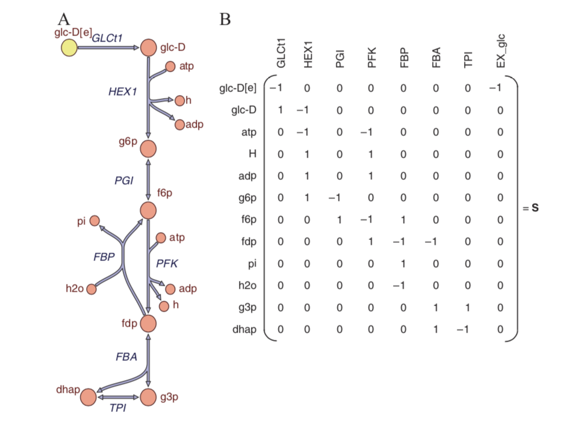

## Basics of Network Reconstruction

### Introduction

Network reconstruction is a long and arduous process that involves building a large network in a step-by-step fashion by identifying one reaction at a time. It is foundational to the bottom-up approach to biology. A reconstruction collects all the available biochemical, genetic, and genomic (BiGG) information that is available on a cellular process of interest, and then organizes it in a formal, mathematical fashion that is consistent with the corresponding fundamental chemical and genetic properties.

Networks are composed of compounds (nodes) and reactions (links). When many reactions are known that share reactants and products, they can be graphically linked together. More and more reactions can be added to a graphical representation as one grows the scope of the network under consideration.

In below, **A** shows the first few steps in glycolysis as an example

Here, **A** shows the first few reactions of glycolysis in a graphical form as a network of interacting reactions that share substrates and products. **B** shows the stoichiometric matrix (S) corresponding to the reactions in **A**. As indicated, each column corresponds to a particular reaction and each row to a particular metabolite.

Above such reaction maps were formed historically as more metabolic reactions were discovered and they were eventually joined together.

Such a map can be represented mathematically. Such mathematical representation is based on the stoichiometric coefficients that count the molecules that are consumed and produced by a biochemical reaction. All such coefficients for all the reactions in a network can be organized in a matrix format; a mathematical matrix akin to a table. (See **B** in above figure) This information is exact, quantitative, and forms the basis for mathematical characterization and assessment of integrative biochemical properties of a network as a whole. It is important to note that a map for a network can be drawn in many different ways, but the mathematical representation is unique.

### Genome-scale Networks

The scope of a reconstruction can grow with each additional biochemical process that is included. Ultimately, a reconstruction can reach a genome-scale when all the known biochemical and genetic processes that are found on a genome are accounted for. Such a reconstruction process is clearly quite laborious and detailed. The scope and content of reconstructions is steadily growing and they now include the details of both protein synthesis and structure, transcriptional regulation, and other processes.

**Vision:** A genome-scale reconstruction aims to be comprehensive, ideally accounting for all relevant genetic elements found in the genome of the target organism. It should be able to put everything found in the target organism in context, systematically integrate all knowledge about the target organism, and in principle should be able to address every phenotypic trait. In a way, such genome-scale reconstruction efforts represent a grand unification theory for biology and constitute the basis for  formulating mechanistic genotype–phenotype relationships. Such formulation requires the conversion of a reconstruction into a **computational genome-scale model (GEM)**.

[Back to Contents](../README.md)
