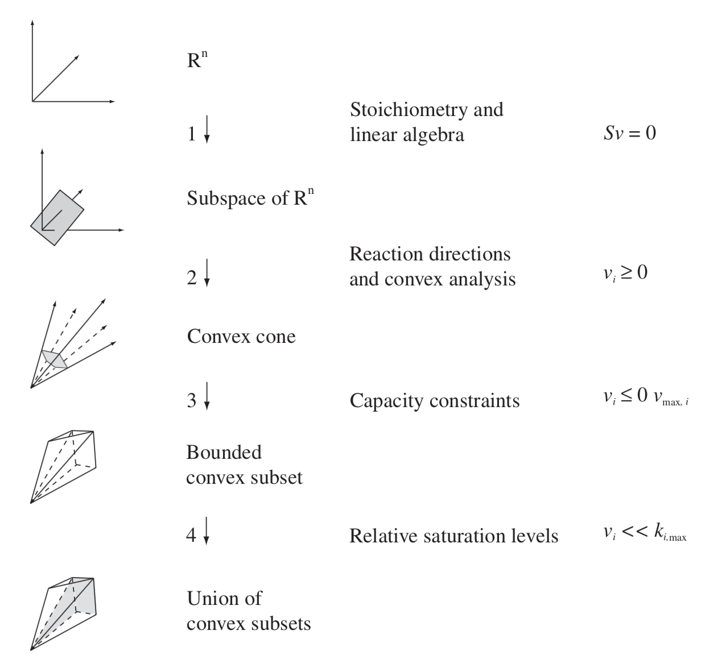

## Constraints

The formal imposition of constraints to form a desired solution space containing all candidate functional states of networks.

### Stating and Imposing Constraints

- *A balance constraint is represented by an equation.* An example is the conservation of mass. In a steady state, there is no accumulation or depletion of compounds; thus, the rate of production equals the rate of consumption for each compound in the network. This balance is represented mathematically as Sv = 0. Similar balance equations can be formulated for other quantities, such as osmotic pressure, electroneutrality, and free energy around biochemical loops

- *A bound is represented by an inequality.* Bounds are constraints that limit the numerical ranges of individual variables and parameters such as concentrations, fluxes, or kinetic constants. Upper and lower limits can be applied to individual fluxes (vmin ≤ v ≤ vmax).

- *Successive imposition of constraints* - Constraints can be applied to the analysis of reconstructed networks to narrow the range of possible functional states (or attainable behaviors), and can be applied in a successive fashion.

In the above image, we have a conceptual illustration of successive application of constraints to narrow down the range of attainable functional states.

Few of the constraints above are:
- The *flux balances* **(Sv = 0)** limit the steady-state fluxes to a subspace that is a hyperplane. (Step 1)
- If the reactions are defined so that all the fluxes are *positive*, this plane
is converted into a semi-finite space, called a cone. (Step 2)
- Because there are *capacity constraints* on the individual reactions (vmax) in the extreme pathways, the length of each edge is limited. This closes the cone (Step 3) and forms a closed solution space in which all allowable network states lie.
- Further segmentation of this space can be achieved if additional constraints, such as *kinetic constants or thermodynamic quantities*.

##### Capacity Constraints
There are capacity constraints that govern cellular processes. These constraints exist because limited numbers of a particular molecule can be present in the cell and it has a maximal activity. Some examples of such constraints are given below,
- **Membrane surface and metabolism :** For metabolic networks, the inputs and outputs are transporters. They reside in the membrane. Some of these protein complexes are large and there is a finite area of cellular membrane. Thus, if many transporters are needed, then the surface area of the membrane can represent a constraint.
- Water solvent capacity is limited, leading to constraints on concentrations.
- Enzyme concentrations are limited.
- **Estimating maximal reaction rates :** Reaction rates in cells are limited by the achievable kinetics.

##### Constraints from Chemistry
- **Flux balances :** Mass cannot be created or destroyed. Thus, when a network is in a steady state, all the fluxes into a node in the network must be balanced by the flows leaving the node. This leads to the flux balance equations : **Sv = 0**. A flux balance is analogous to Kirchhoff’s first law of electrical circuits.
-  **The steady-state assumption :** Although no network is strictly in a steady state, many homeostatic states are close to being steady, and flux balances are quite useful for analyzing functional states of the network. Although a flux balance may not be obeyed strictly at all times, over reasonably long times there is no accumulation of mass in the network and a time-averaged flux balance applies.

For each type of data, there are different kinds of constraints we can apply as shown above.

The imposition of the myriad definable and imposable constraints *does not always
lead to a single solution* to estimate the functional state of a network. We might end up with a space of various solutions.

[Back to Contents](../README.md)
 
