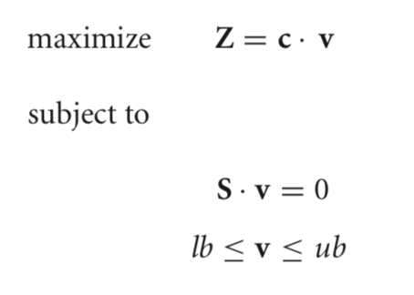
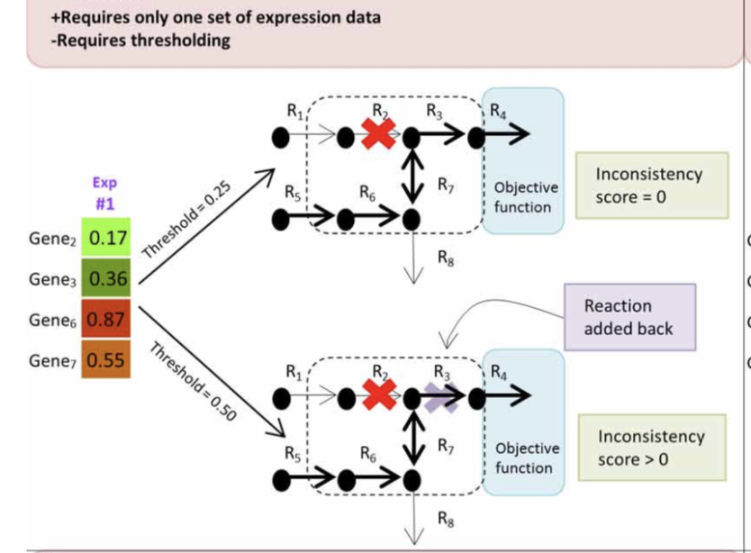
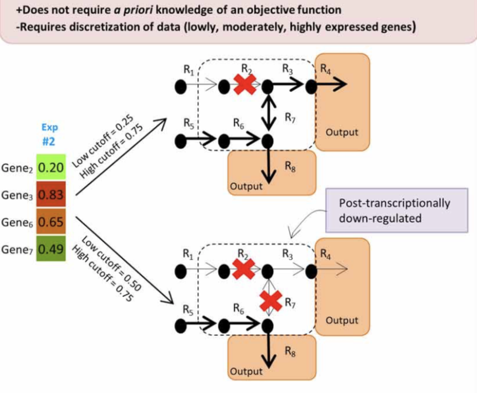
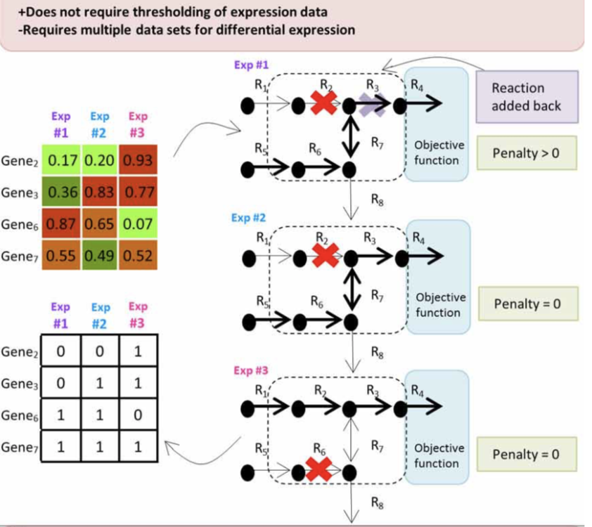
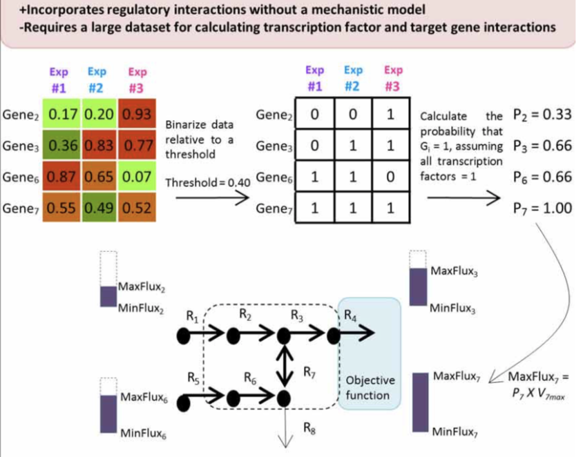

## Integration of Expression Data in GEM Reconstructions

With the advent of high-throughput technologies, the field of systems biology has amassed an abundance of “omics” data, quantifying thousands of cellular components across a variety of scales, ranging from mRNA transcript levels to metabolite quantities. Methods are needed to not only integrate this omics data but to also use this data to heighten the predictive capabilities of computational models.

Several recent studies have successfully demonstrated how flux balance analysis (FBA), a constraint-based modeling approach, can be used to integrate transcriptomic data into genome-scale metabolic network reconstructions to generate predictive computational models.

**Flux balance analysis (FBA)**, a constraint-based modeling approach, can be used to probe these network reconstructions by predicting physiologically relevant growth rates as a function of the underlying biochemical networks. To do so, FBA involves delineating constraints on the net- work according to physicochemical, environmental, regulatory, and thermodynamic principles. After applying constraints, the solution space of possible phenotypes narrows, allowing for more accurate characterization of the reconstructed metabolic network. *Omics data can be used to further constrain the possible solution space and enhance the model’s predictive powers.*

### Flux Balance Analysis

FBA is a constraint-based modeling approach that characterizes and predicts aspects of an organism’s metabolism.

To use FBA, the user supplies a metabolic network reconstruction in the form of a *stoichiometric matrix, S,* where the rows in S correspond to the metabolites of the reconstruction and the columns in S represent reactions in the reconstruction. For each matrix element, a stoichiometric coefficient *sij* conveys the molecularity of a certain metabolite in a particular reaction, with *sij* ≥ 1 indicating that the metabolite is a product of the reaction, *sij* ≤ −1 a reactant, and *sij* = 0 signifies that the metabolite is not involved.

Subsequently, a system of linear equations is established by multiplying the S matrix by a column vector, v, which contains the unknown fluxes through each of the reactions of the S matrix. Under the assumption that the system operates at steady-state, that is to say there is no net production or consumption of mass within the system, the product of this matrix multiplication must equal zero, **S · v = 0**. Because the resulting system is underdetermined (i.e., too few equations, too many unknowns), linear programming (LP) is used to optimize for a particular flux, Z, the objective function, subject to underlying constraints. The objective function typically takes on the form of **Z = c · v**, where **c** is a row vector of weights for each of the fluxes in column vector **v**, indicating how much each reaction in v contributes to the objective function, **Z**.

The following linear program is an example of how FBA problems are formulated:

which outlines the objective function to be optimized,  the steady state assumption, and also describes the upper and lower bounds, ub and lb, of each of the fluxes in v according to such constraints as enzyme capacities, maximum uptake and secretion rates, and thermodynamic constraints.

*Thus, the task of FBA is to find a solution to v that lies within the bounded solution space and that optimizes the objective function at the same time. *

### Algorithms for the Integration of Expression Data

Several recently developed algorithms have demonstrated how expression data can be incorporated into FBA models to further constrain the flux distribution solution space in genome-scale metabolic network reconstructions.

Below are few of the popular algorithms:

#### GIMME

One such method that guarantees to both produce a functioning metabolic model based on gene expression levels and quantify the agreement between the model and the data is called the **Gene Inactivity Moderated by Metabolism and Expression (GIMME)** algorithm.

To execute this algorithm, the user supplies a set of gene expression data, a genome-scale metabolic network reconstruction, and *at least one specified metabolic functionality, or objective function*, that the cell is assumed to achieve.

Broken into two steps, the GIMME algorithm first runs FBA on the original reconstruction to find the maximum possible flux through the specified functionalities. Subsequently, under the assumption that gene expression data correlate with reaction fluxes, GIMME compares the experimental mRNA transcript levels to a user-specified threshold and methodically removes reactions from the model whose mRNA transcript levels fall below the given threshold.

However, in the event that the resulting model is unable to achieve the desired objective function, GIMME solves an LP problem that adds sets of the inactive reactions back into the system in such a way that minimizes deviation from the expression data. To quantify this deviation, an **inconsistency score** is calculated for each reaction by multiplying the flux necessary to achieve a defined value of the objective function and the distance between the experimental mRNA transcript level and the threshold level. *By minimizing this inconsistency score*, GIMME uses expression data to define a functioning metabolic model that meets the assumed functionality and is consistent with the experimentally measured gene expression data.

*Refer: * [Context-Specific Metabolic Networks Are Consistent with Experiments, PLoS, 2008](https://journals.plos.org/ploscompbiol/article?id=10.1371/journal.pcbi.1000082)

#### iMAT

Similar to GIMME, the **Integrative Metabolic Analysis Tool (iMAT)** results in a functioning model in which the *fluxes of reactions correlated with high mRNA levels are maximized and the fluxes of reactions associated with low mRNA levels are minimized*.

A key difference is that iMAT *does not require a priori knowledge of a defined metabolic functionality*.

Briefly, this method establishes a tri-valued gene-to-reaction mapping for each reaction in the model according to the level of gene expression in the data. More specifically, highly, moderately, and lowly expressed genes relative to a user-specified threshold are assigned values of 1, 0, and −1, respectively, resulting in sets of highly expressed reactions (RH) and sets of lowly expressed reactions (RL). The algorithm then solves a mixed integer linear programming (MILP) problem according to stoichiometric and thermodynamic constraints while also maximizing RH and minimizing RL. Mirroring GIMME, the presence of reactions is allowed to deviate from the expression data in order for the algorithm to result in a functioning model. Thus, like GIMME, iMAT returns a functioning metabolic model that integrates expression data with a genome-scale metabolic network reconstruction by *maximizing the number of highly expressed reactions and minimizing the number of lowly expressed reactions*; however, unlike GIMME, this method does not demand that the user supply functionalities that the model is assumed to meet.

By removing this need for user-specified objective functions, iMAT bypasses assumptions about metabolic functionalities of a particular network, which **proves advantageous for models where there is no clear objective function, as in models of mammalian cells**.

*Refer: * [Network-based prediction of human tissue-specific metabolism, Shlomi, Nature Biotechnology, 2008](https://www.nature.com/articles/nbt.1487)

#### MADE

While both GIMME and iMAT rely on user-specified thresh- old values to determine which reactions are highly expressed and which reactions are lowly expressed, **Metabolic Adjustment by Differential Expression (MADE)** uses statistically significant changes in gene expression measurements to determine sequences of highly and lowly expressed reactions.

In order for MADE to generate these expression states, the user *must supply expression data from two or more experimental conditions*. For each gene, the algorithm calculates the changes in the mean expression level across the conditions and returns a sequence of differences, according to an increase (+1), decrease (−1) or no change (0) in mRNA levels. MADE then determines each gene’s sequence of binary expression states across the experimental conditions by finding the pattern of changes that most closely mirrors the sequence of differences. While determining this sequence of binary states, MADE simultaneously solves the FBA problem for each condition, resulting in a sequence of functioning models.

The statistical significance of the expression changes is used as a weighting to resolve conflicts between expression changes and model functionality. MADE’s reliance on statistically significant changes across various experimental conditions to constrain reaction activity avoids the arbitrariness surrounding the determination of a proper threshold in prior methods.

*The lack of correlation between mRNA levels and protein levels makes it difficult to accurately determine when genes are “turned on,” and when they are “turned off.” Therefore, in eliminating this need for thresholding, MADE removes significant user-bias from the system.*

#### E-FLUX

Whereas GIMME, iMAT, and MADE incorporate gene expression data into their models by reducing gene expression levels to binary states, the method E-Flux attempts to more directly incorporate gene expression data into FBA optimization problems by constraining the maximum possible flux through the reactions.

Rather than setting the upper bounds of a reaction to some large constant or 0, mirroring the implementation of binary-based algorithms, E-Flux constrains the upper bound of a reaction according to its respective gene expression level relative to a particular threshold. In cases where the gene expression data is below a certain threshold, tight constraints are placed on the flux through the corresponding reactions in the reconstruction; conversely, in cases where the gene expression is above a certain threshold, loose constraints are placed on the flux through the corresponding reactions.

The width of this “flux cone” is adjusted by changing the maximum possible flux in the upper bound of the FBA optimization problem according to some function of the gene expression level.

While the other algorithms described above use mRNA expression data to predict binary states for the network reactions, E-Flux uses the transcript levels to determine the degree to which a reaction is active or inactive. In doing so, E-Flux offers a more physiologically relevant depiction of the continuous nature of the reaction activity gradient.

#### PROM

In contrast to the other methods discussed, which focused solely on integrating gene expression data into genome-scale metabolic network reconstructions, **Probabilistic Regulation of Metabolism (PROM)** aims to fuse together metabolic networks and transcription regulatory networks with expression data.

To run PROM, the user supplies a genome-scale metabolic network reconstruction, a regulatory network structure describing transcription factors and their targets, and a range of expression data from various environmental and genetic perturbations. Given this expression data, PROM binarizes the genes with respect to a user-supplied threshold to evaluate the likelihood of the expression of a target gene given the expression of that gene’s transcription factor.

For example, a probability of 0.6 for gene X when its transcription factor Y is on represents that in 60% of the microarray samples when transcription factor Y is highly expressed, gene X exhibits high expression. Upon calculating these probabilities, PROM then incorporates them into FBA by constraining the upper bound to **P × Vmax**, where **P** is the probability that the gene is on for that reaction and **Vmax** is the maximum flux through that reaction.

Therefore, although PROM does binarize the data to calculate the probabilities of gene activity, the actual integration of the expression data into the FBA model does not reduce the reactions to on/off states; rather, similarly to E-Flux, PROM constrains the maximum flux through relevant reactions according to transcription factor activity.

**Main Reference:**
[Integration of expression data in genome-scale metabolic network reconstructions, Frontiers](https://www.frontiersin.org/articles/10.3389/fphys.2012.00299/full)

[Back to Contents](../README.md)
