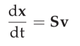

## Mathematical Properties of Reconstructed Networks

### The Stoichiometric Matrix

The stoichiometric matrix is formed by the stoichiometric coefficients of the reactions that constitute a reaction network. It is organized such that every column corresponds to a reaction and every row corresponds to a compound. The entries in the matrix are stoichiometric coefficients that are integers. Each column that describes a reaction is constrained by the rules of chemistry, such as elemental balancing. Every row thus describes all the reactions in which the corresponding compound participates, and therefore how the reactions are interconnected.

The stoichiometric matrix is a data matrix. The data that go into building a genome-scale stoichiometric matrix come primarily from the annotated genomic sequence and detailed assessment of the literature (bibliomic data) that is available about the target organism. The stoichiometric coefficients represent counts of molecules that are involved in a chemical reaction. Chemical reactions come with conservation relationships of elements, charge, and other properties. These properties must be represented accurately. The cellular location of a reaction is included through the assignment of a metabolite to a cellular compartment.

The stoichiometric matrix is a connectivity matrix and gives the structure (or the topology) of a network. This structural information results in the definition of pools and pathways that are associated with the null spaces of the stoichiometric matrix.

For large networks, the stoichiometric matrix has mostly zero elements. It is a *sparse matrix* and may require sparse matrix representation and computational procedures as it reaches the genome-scale.

For example, in the above figure we have some  Stoichiometric Matrices, for the sample system as shown.

Mathematically, the stoichiometric matrix represents a transformation, or a mapping, of one vector (the flux vector) to another (the vector of time derivatives of the concentrations). Such a mapping operation comes with four fundamental subspaces (the row, the null, the column, and the left null spaces). Each one of these spaces contains chemically and physically meaningful quantities.

#### Mapping fluxes onto concentration time derivatives

Mathematically, the stoichiometric matrix S is a linear transformation (below figure) of the flux vector , to a vector of time derivatives of the concentration vector  as .

Another notation is  which perhaps makes it clearer that the dx/dt is a vector, and that   is a linear transformation.

If there are m metabolites (xi) found in the network and n reactions (vi), thus:   .

For a typical biological network there are more reactions than compounds, or n > m.
The matrix S may not be full rank, and therefore rank(S) = r < m.

#### The four fundamental subspaces

There are four fundamental subspaces associated with a matrix.
1. **Null space:** the null space of S contains all the steady-state flux distributions allow- able in the network. The steady state is of much interest as most homeostatic states are close to being steady states.
2. **Row space:** the row space of S contains all the dynamic flux distributions of a network, and thus the thermodynamic driving forces that change the rate of reaction activity.
3. **Left null space:** the left null space of S contains all the conservation relationships, or time-invariants, that a network contains. The sum of conserved metabolites or conserved metabolic pools do not change with time and are combinations of concentration variables.
4. **Column space:** the column space of S contains all the possible time derivatives of the concentration vector, and thus how the thermodynamic driving forces move the concentration state of the network.

### Network Topological Properties

The stoichiometric matrix is a connectivity matrix. Elementary topological properties of the network it represents can be computed directly from the individual elements of S. Direct topological studies are interesting from a variety of standpoints. They focus on relatively easy to understand and intuitive properties of the structure of the network. Elementary topological properties relate to how connected a network is, and how its components participate in forming the connectivity properties of the network.

The elementary topological properties are determined based on the non-zero elements
in the stoichiometric matrix. Thus, we define the elements of a new matrix  as

which is the binary form of S. This matrix is composed of only zeros and ones. If  is unity, it means that compound i participates in reaction j.

S is a **sparse matrix** A number of genome-scale stoichiometric matrices have been reconstructed. As there are typically only a handful of compounds that par- ticipate in a reaction out of hundreds of compounds participating in a network, the stoichiometric matrix is sparse. A sparse matrix is mostly composed of zero elements.

#### Participation and Connectivity
One can easily define and compute simple properties of the stoichiometric matrix that describe its topological features. The number of non-zero entries in a row and a column of S give two elementary topological properties that are easy to understand.

**Reaction participation number :** The sum of the non-zero entries in a column,

above gives the number of compounds that participate in reaction j. This quantity, πj, can be called the **participation number** for a reaction.

**Compound connectivity :** The sum of the number of non-zero entries in a row,

gives the number of reactions in which compound i participates. This number, ρi, is a measure of how connected, or linked, a compound is in the network. A compound that participates in a large number of reactions will form a highly connected node on the reaction map. This number is called the **connectivity number**, for the node, or simply its *connectivity*.

**Node connectivity and network states :** It should be noted that highly connected nodes may represent *effective targets* for drug development. However, topological properties of networks must be interpreted in the context of the more biologically relevant functional network states and their properties. One such consideration, for instance, is that a metabolic network must make all the biomass components of the cell in order for it to grow. Therefore, even eliminating a step in a linear low-flux pathway leading to the synthesis of co-factors, vitamins, or amino acids, will prevent a genome-scale metabolic network from supporting growth. It has been found that the connectivity of a node does not correlate with the lethality of its links.

[Back to Contents](../README.md)
