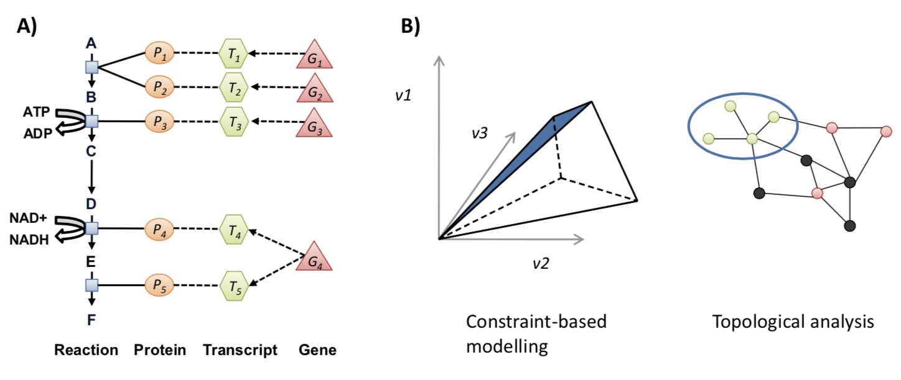
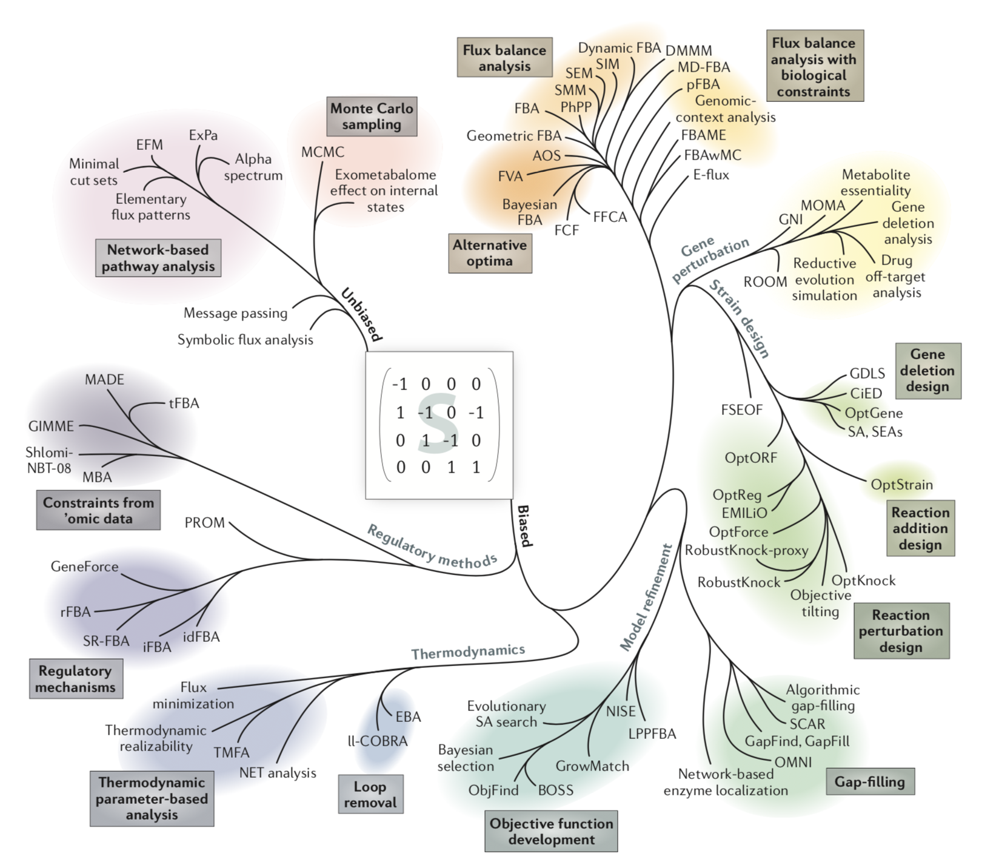
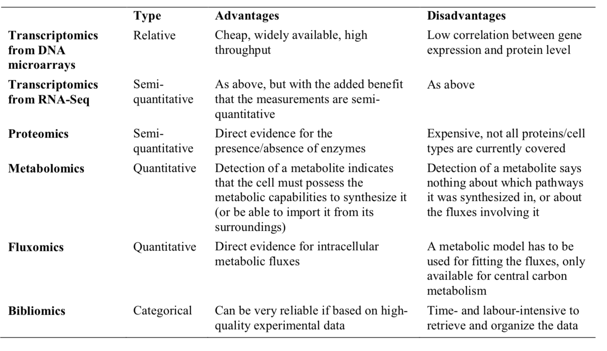

## Metabolic Network Perspective

 There was a need to develop a mathematical framework to deal with uncertainty in data, and to quantify the control each of the enzymes had in the model. This led to the development of **metabolic control analysis (MCA)**.

 This framework was mainly applicable to small networks, and the availability of kinetic parameters continued to be limiting. If only the steady state metabolic fluxes inside the cell were of interest (rather than the dynamic change in metabolite pools) then those could be estimated in a method called **metabolic flux analysis (MFA)**.

 This method relies on measuring the rates of production/consumption of metabolites (called exchange fluxes) in the growth medium. If the set of possible enzymatic conversions is known, then the internal fluxes can be fitted from the exchange fluxes by linear regression. However, this requires that enough exchange fluxes are measured so that the resulting equation system is determined. Another issue was the determinability of fluxes in parts of the metabolism where there were cyclic or parallel reactions.

 A large step forward was taken when the models were constrained to be optimal with respect to some cellular objective (Fell and Small, 1986). This formed the foundation for **constraint-based modelling (CBM)** of metabolism.

 If the traditional approach to metabolic modelling is to describe the components of a model in such detail that the model correctly represents the phenotype, then the constraint-based approach is rather to impose increasingly detailed constraints on the solution space so that *only relevant phenotypes are feasible*. The term CBM is, at least when applied to metabolic modelling, largely synonymous to flux balance analysis (FBA), although FBA is a more narrow term.

#### Applications of genome-scale metabolic models

The models used in practice are anything but small; rather, they contain thousands of reactions and metabolites. Ever since genome sequencing took off in the 1990s is has, at least in theory, been possible to identify each enzyme that exists in an organism, and thereby infer a metabolic network which describes the full metabolic capabilities of the organism. These models have therefore come to be known as **Genome-Scale Metabolic Models (GEMs)**.

In the above figure in **A**, we see the layout of a genome-scale metabolic model (GEM). A GEM can be viewed as a highly structured map of how metabolism is controlled at different levels. At the bottom are the metabolic reactions and the metabolites which they involve. Each reaction can then be catalysed by zero or more enzymes. The enzymes are further linked to the corresponding transcripts, which in turn are linked to the corresponding genes. **B** shows the two main applications of GEMs. In *CBM* the GEM is viewed as an equation system which describes how metabolism in a cell operates. In *topological analysis* the GEM is viewed as a map of how components in a cell interact with each other.

Thus, GEMs can be viewed as detailed maps of connections between the different levels of metabolism. Thereby they can provide a mechanistic description all the way from the metabolites, via reactions, enzymes and transcripts, up to the genes. Model elements at all levels can be extensively annotated so that GEMs can serve as highly structured databases.

#### Constraint-Based Modelling using GEMs

More than 100 algorithms for constraint-based modelling using GEMs have been published, as described in detail in an excellent review by [Lewis et al. (2012)](https://www.nature.com/articles/nrmicro2737).

Above, *the ‘phylogeny’ of constraint-based modelling methods*, Over the past few years, the repertoire of tools for constraint-based reconstruction and analysis (COBRA) modelling has rapidly expanded. Because of the versatility and scalability of COBRA models, more than 100 methods have been developed for their prediction and analysis, all based on analysis of the underlying metabolic network structure (that is, the stoichiometric matrix).

#### Data Integration using GEMs

A number of algorithms have been developed for the purpose of using GEMs as scaffolds for data integration and interpretation.

- **Fluxomics:** Measured intracellular fluxes, for example using 13C labelled substrates, represent a data type that is directly applicable to integration with GEMs. In order to go from measured labelling patterns in metabolites to fluxes, an atom mapping model is used. These models are similar to GEMs in that they are stoichiometric models of metabolism, but they can track each atom though the network, rather than each metabolite. They are traditionally rather small models, and only built for *central carbon metabolism*.

- **Metabolomics:** Large-scale quantification of internal metabolites has been made possible thanks to developments in mass spectrometry and NMR technology. Since GEMs are based on the assumption that metabolite pools are in quasi-steady state, the concentrations of metabolites are not immediately possible to integrate into GEMs. Instead, the main use of metabolomics data has been to evaluate the capabilities of the GEM. This can then lead to directed search for the missing functions, thereby generating new biological knowledge as well as improving on the model.

- **Transcriptomics:** There is not a good correlation between transcript level and flux, owing to the several layers of regulation between them. It is therefore difficult, or impossible, to directly use the expression levels to modify the model constraints, although several attempts have been made.  *The most common use of transcriptomics data is therefore to classify genes in a binary fashion; either as expressed or non-expressed.* An alternative approach, developed by [Patil and Nielsen (2005)](https://www.ncbi.nlm.nih.gov/pmc/articles/PMC549453/), uses the data in a different way. Rather than looking at the expression level, they look at the significance of differential expression between two conditions, and make use of the network topology to analyse the data (namely *Reporter Metabolite Analysis*).

#### Reconstruction of cell type-specific GEMs

The cells of multicellular organisms can have very different phenotypes even though they share the same genotype.

In order to model cellular metabolism, it is therefore necessary to reconstruct a GEM specifically for the relevant cell type. In practise, this is done by starting from a generic network for the organism in question, and then manually or algorithmically select a subset of enzymes which are thought to be present in the specific cell type.

In 2007, two such generic GEMs were published for human: **Recon 1** (Duarte et al., 2007) and **EHMN** (Ma et al., 2007). A number of cell type-specific models have been *manually reconstructed* by using these models as scaffolds.

In parallel to this there have also been a number of algorithms developed which aim at reconstructing cell type-specific GEMs in an *automated manner* based on high-throughput data.

Note that the problem of inferring a cell type-specific network from a generic model is closely related to the problem of inferring an organism-specific network from a generic reaction database. The difference is in the input data. While the organism-specific models are reconstructed based on protein homology, the cell type-specific models have to be reconstructed from omics data.

In the above table, we have some relevant omics types and their respective advantages and disadvantages.

**GIMME** takes transcriptome data as input and removes reactions for which the expression levels for the genes are below some threshold. It then constrains the model to perform some function, after which is uses a gap filling algorithm to reinsert the required reactions so that the model can satisfy the constraints. The state of the art algorithm, **MBA**, adds another layer of complexity by dividing the reactions with supporting evidence into two groups; one with reactions which must be included, and one with reactions that should be included. The algorithm then uses a gap filling algorithm to include as many reactions as possible from the second group while using as few reactions as possible for gap filling.

[Back to Contents](../README.md)
