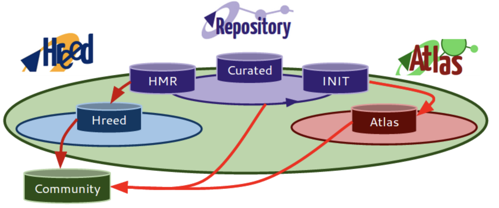
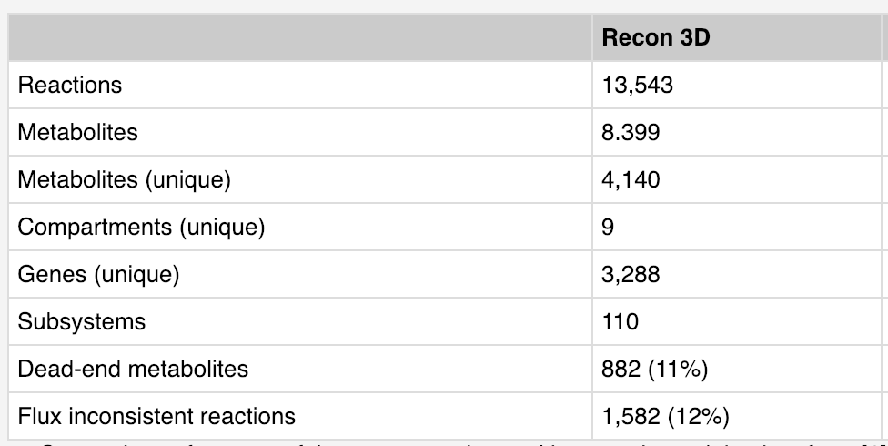

## Some Generic Human Metabolic Models

## HMR Models

The Human Metabolic Reaction (HMR) is a genome-scale metabolic model for the generic human cell.

**In its latest version (HMR2), it contains 3'765 genes associated with over 8'000 reactions and over 3'000 unique metabolites.**

The HMR Models can be downloaded from **[here](http://www.metabolicatlas.org/downloads/hmr)**

For simulation purposes in MATLAB, the authors recommend to import the SBML file using the RAVEN Toolbox function *importModel*.

The Human Metabolic Atlas Resource also provides various Tissue models, which can be accessed from **[here](http://www.metabolicatlas.org/downloads/tissue)**.

We can also have a look at the various pathways along with their annotations in the Metabolic Atlas Map**[here](http://www.metabolicatlas.org/atlas)**.

## Recon Models

The human metabolism resource has been developed by the systems biology community over the past decade and describes metabolic reactions and pathways known to occur in at least one cell type in the human body.

Details on the human metabolism resource, the latest updates, and the underlying reconstruction, Recon 3D, can be found in Brunk et al.. In brief, this version was created by expanding the previous version of the human metabolic reconstruction, Recon 2 through the addition of new metabolites, transport reactions, and catalyzing reactions guided by publically available metabolomics data. Furthermore, we added metabolites and reactions from HMR 2.0, a drug module, a transport module, host-microbe reactions, as well as for the absorption and metabolism of dietary compounds. During the reconstruction process, we followed the established protocol.

**In total, 13,543 reactions and 4,140 unique metabolites are represented in this resource, representing an expanded metabolic scope of 82% and 58%, respectively.**

**The metabolic reactions are associated with 3,288 genes, representing 17% of the functionally annotated gene products in the human genome (build 38).**

Numerous aspects of the reconstruction content were refined and expanded in this newest release, including 2,181 gene-protein-reaction (GPR) associations, reaction/metabolite duplication, reaction directionality, and thermodynamic feasibility. Overall, the human metabolic resource is based on biochemical information that were manually retrieved from more than 2,000 scientific publications and books.

Can be downloaded from **[here](https://www.vmh.life/#home)**

**References:**
1. [Human metabolic atlas: an online resource for human metabolism](https://www.ncbi.nlm.nih.gov/pmc/articles/PMC4513696/)
2. [Recon3D enables a three-dimensional view of gene variation in human metabolism](https://www.nature.com/articles/nbt.4072)

[Back to Contents](../README.md)
