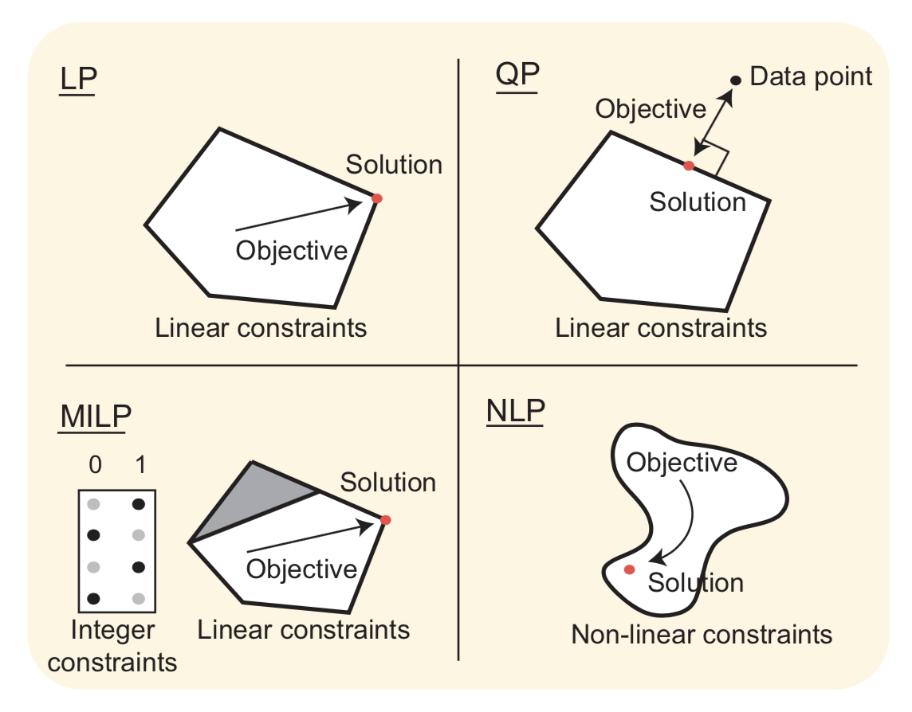
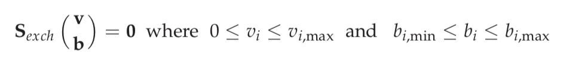
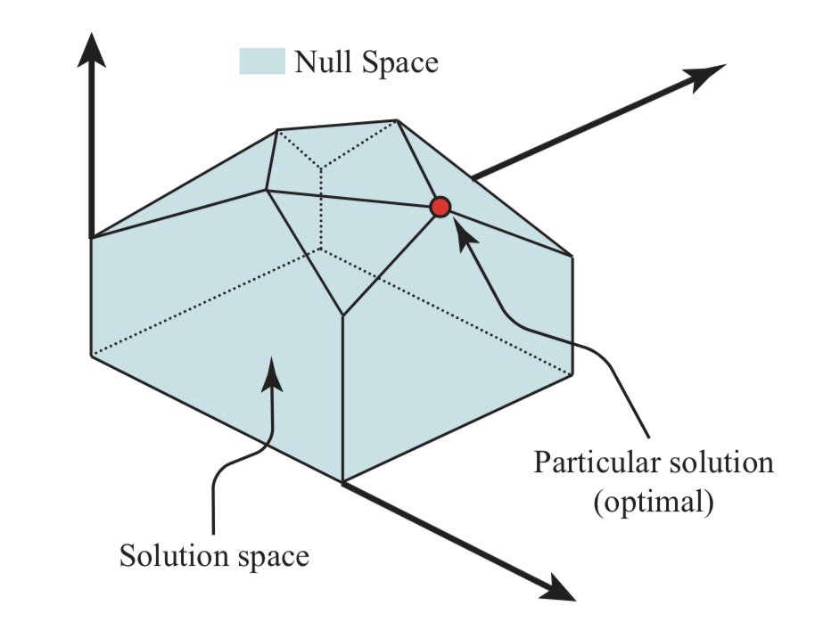
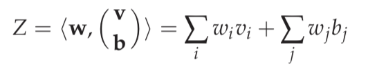

## Optimization

Even under different constraints imposed, a reconstructed network can have many possible functional states.
The application of **constraint-based optimization methods** introduces quantitative ways of estimating, computing, and understanding functional states of *networks that correspond to phenotypic functions*.

### Overview of Constraint-based Methods

**Constraint-based reconstruction and analysis (COBRA) :** The COBRA approach consists of three fundamental steps:
- *first*, a genome-scale network reconstruction is carried out.
- *second*, the appropriate constraints are applied to form the corresponding **genome-scale model (GEM)** in silico, and
- *third*, COBRA methods are applied to evaluate the properties of the GEM.

**Optimization methods :** The COBRA methods rely on the use of various optimization methods including (see figure):

- **Linear programming (LP) :** This method is used when the problem to be solved involves a linear set of constraints (equalities and inequalities) and a linear objective function. LP is the basis for *flux balance analysis (FBA)*.
- **Quadratic programming (QP) :** This method is used when the problem to be solved involves a linear set of constraints (equalities and inequalities) and a quadratic objective function. A quadratic objective arises when one uses a Euclidean distance as an objective function. When computing the Euclidean distance, the elements of a vector are raised to a second power. The constrained ‘least squares problem’ is solved using QP.
- **Mixed integer linear programming (MILP) :** The formulation of LP problems often leads to the use of discontinuous variables. Often, logical variables are introduced that only take on a value of zero or one, such as when reaction presence/absence calls are introduced as variables. MILP is used to solve this class of problems.
- **Non-linear programming (NLP) :** The most complicated optimization problems involve the use of non-linear constraints and/or a non-linear objective function. In general, such problems are hard to solve. One fundamental issue that arises is that the solution space being searched is non-convex. In such a circumstance, one cannot guarantee finding the global optimum for the objective function in the space.

These optimization methods have been deployed in the various COBRA methods that have been developed.

**The COBRA methods:** Over 100 in silico methods have been developed under the COBRA framework. This growing number of methods can be broadly classified into two main categories: *unbiased methods*, that are used to globally characterize a solution space; *biased methods* are the larger family of methods that uses **objective functions** for a variety of purposes.

**The COBRA toolbox :** The widespread use of COBRA methods has spurred the development of accessible software. The [COBRA toolbox](https://opencobra.github.io/cobratoolbox/stable/) implements the COBRA methods in MATLAB, which is an extensively used, commercially available software package. Thus, any user can implement the growing number of COBRA methods for a reconstructed network that they wish to characterize.

#### Finding Functional States
Statement of constraints For typical biological networks, the number of reactions (n) is greater than the number of compounds (m) resulting in a plurality of feasible steady-state flux distributions. Although infinite in number, the steady-state solutions lie in a restricted region called the null space, and additional constraints govern the expression of a phenotype.

However, a certain set of phenotypes are expressed under particular conditions. Optimization can be used to find particular solutions of interest. Linear optimization can be used to find solutions of interest within the bounded null space. The bounded null space is defined by:

where **vi** are the internal fluxes and **bi** are the exchange fluxes.

In the above image we can seee how of a particular solution located within a finite null space, this is possible with the the above constraints.

**Statement of objective :** To pick out particular solutions within this space, one has to define the desired properties of such solutions. Mathematically, the definition of the solutions sought is stated in the form of an objective function. A general linear objective function is defined as:

where the vector **w** is a vector of weights (**wi**) on the internal and exchange fluxes, **vi** and **bi**, respectively. The weights are used to define the properties of the particular solutions sought. **Z** is then optimized, i.e., minimized or maximized as appropriate.

 *The solutions to these equations give the best use of the defined network to meet the stated objective function in a steady-state.*

**Linear programming :** With a linear objective function (Z), this constrained optimization procedure is known as linear programming (LP). The objective function is a user-specified statement that describes the solution to be computed.

There are numerous methods that have been developed to analyze constraint-based reconstructions of metabolic networks using experimental data to answer biological questions. Find here [the list of some of these methods and questions they can help to answer](methods.md).

One optimal solution is rarely of interest in iso- lation. The constraint-based optimization methods are scalable and can be applied repeatedly for varying environmental and genetic parameters. This scalability has spurred a growing number of analysis methods that have been developed under the constraint-based approach.

Deployment of COBRA methods Quality GEMs and the suite of COBRA tools have led to a spectrum of applications. The COBRA methods are used to address a variety of questions. A series of well-curated GEMs for model organisms have been widely used, and COBRA methods have been deployed to study their various attributes and uses.

[Back to Contents](../README.md)
