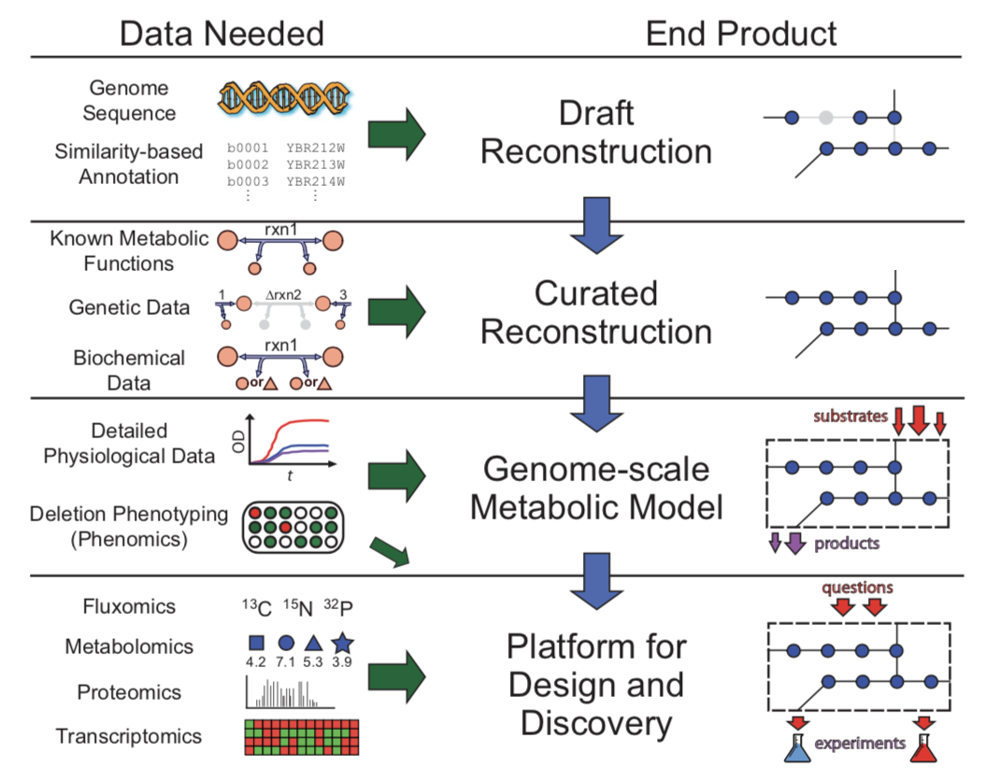
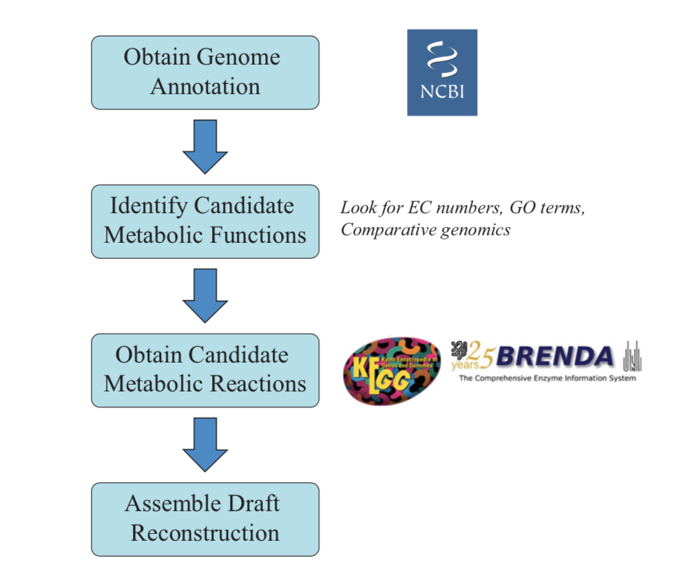
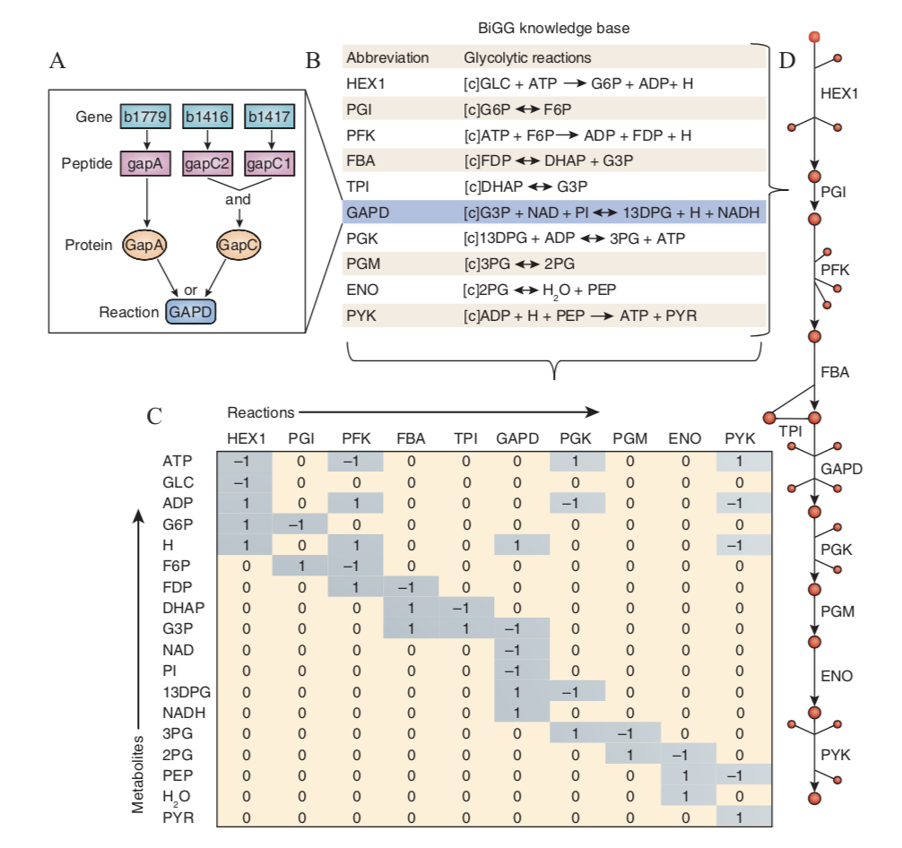
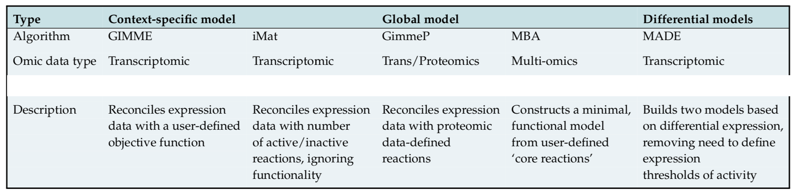

## Process of Network Reconstruction for Different Types of Networks

The smallest element of a network reconstruction is a chemical reaction. To define this, we need to know the participating compounds and determine the genetic basis for the transformation. This defines the chemical transaction. A series of these are then strung together to form a pathway. All pathways then come together to form a map of the network. A network assembled in this manner will have gaps that require curation and gap-filling.

Network reconstruction, like sequence assembly, is an organized process that starts with fundamental elements that are systematically assembled and built into larger and larger constructs. This process is hierarchical and it culminates with genome-scale knowledge.

### Reconstruction is a Four-step Process

The bottom-up reconstruction process at the genome-scale can be broken down into four basic steps as in below:

Each one of these four steps relies on different data types. The incorporation of each data type requires a different computational and analytical approach.

#### 1. Draft Reconstruction

The starting point for a bottom-up reconstruction is the enumeration of components in the network.

The automated process involves the retrieval of disparate data types and interlinking them (as in above figure). The process begins with obtaining the annotated genome sequence of the target organism. The genome sequence is then used to subset the ORFs (open reading frames) based on the information in the functional annotation of the corresponding gene products. In the case of metabolism, this would involve selecting all ORFs that encode functions relevant to metabolism, and similar subsetting would apply to other networks that one wants to reconstruct. This list is then compared to entries in a database that has information about the detailed biochemical functions of the gene product. In the case of metabolism, this involves the identification of the metabolic reactions the gene product is involved in catalyzing.

The list of all such reactions is then assembled and the genetic basis for each is documented. The protein that is formed from the translation associated with the transcript is identified, and one can obtain an identifier that can be used to map proteomic data onto this protein. Finally, the assembly of the enzyme complex is described. This completes the **gene-to-protein-to-reaction (GPR)** association that describes the genetic basis for a metabolic reaction.

#### 2. Manual Curation

The enzymes identified on the genomic sequence are either identified from previous cloning experiments in the target organism, or, more likely, from sequence similarity analysis with a known gene from another organism. A ‘standard’ biochemical reaction will have been associated with this enzyme during the formation of the draft sequence because genomic annotation only contains generic information about a metabolic function.

The manual curation step includes the examination of the draft reconstruction in great detail. The additional information that is incorporated at this stage falls into many categories, including known metabolic functions, information about the co-factor usage of the enzyme, any relevant genetic and physiological data that are available, and information about cellular location where the reaction takes place. Thus, different levels of information are needed to obtain a detailed description of a biochemical transformation.

Following manual curation, a variety of data and information has now been assembled for the target organism. If you have not gone through this process personally, it is hard to appreciate the depth of the knowledge that is represented in a reconstruction. When the process is completed, visual representations of the results often take the form of tables of reactions, pathway maps, and GPRs .

*Once constructed, GPR associations can be used to relate various data types, including genomic, transcriptomic, proteomic, and flux data.*

#### 3. Conversion to a computational format

The conversion of BiGG data into a mathematical format is to be done. Connections between genes and reactions can be represented as GPR associations by using Boolean rules or visualized using graphic images. A list of charge and elementally balanced metabolic reactions can be represented in a stoichiometric matrix (S). The stoichiometric coefficients in this list of chemical reactions can be organized as a table, as in **C** of below figure.

A curated reconstruction that is mathematically represented can be used to compute integrated cellular functions that result from the simultaneous activity of multiple gene products. The mathematical form of the curated reconstruction is used to compute basic cellular states, such as the provision of all the needed compounds to produce growth. Initially, a metabolic reconstruction would just have some basic features.

 At this stage, one can perform various tests on the functionality of the reconstruction like:
 - Ensure that the reconstruction uses a logical set of metabolic pathways, not any unorthodox routes that might occur due to any flux loops.
 - Determine if the reconstruction is able to secrete the known secretion products under the particular growth condition.
 - Evaluate whether the reconstructed network can support growth on all the primary substrates on which the organism is known to grow and so on.

 Once this stage has been accomplished, we can move to the final stage of the reconstruction process that involves comprehensive evaluation and validation of network properties.

#### 4. Network evaluation and validation

With a computational model of a network that has the ability to meet growth and basic physiological demands, we incorporate and examine other organism-specific network properties. This ability then leads to the evaluation of the properties and capabilities of the reconstructed network and validation against data sets available for the target organism. This validation process can be quite comprehensive if much data is available for the target organism.

*The result of this four-step process is a mathematical representation of all the biochemical, genetic, and genomic information available for the target organism. This network underlies the integrated metabolic functions of the organism.*

### Uses of Reconstruction

1. **Retrospective analysis vs. prospective uses :** The reconstruction of a network is based on what is known. In other words, it requires a retrospective evaluation of all the knowledge that is available about the target organism. This knowledge is then converted to a mathematical format. Once a computational model has been formed based on the knowledge base, then prospective uses of the network reconstruction emerge.

2. **Mapping omics data: content for context :** A reconstruction represents a knowledge base against which comprehensive omics data can be mapped. For instance, the genome-scale metabolic reconstruction for human can be tailored to a particular cell and tissue types based on expression profiling. Proteomic data can also be used to build models of metabolism. Several methods have been developed to map omics data onto reconstructions, examples in below table.

3. **Finding missing parts: gap-filling :** The incompleteness of a bottom-up reconstruction brings out the holes or gaps in our knowledge base about the target organism. Algorithms have been developed to automatically fill in such gaps. Such computations basically generate hypotheses for what is missing and thus systematize the discovery process.

4. **Understanding complex processes :** Genome-scale models can be used to compute, simulate, and study complex cellular processes.

[Back to Contents](../README.md)
