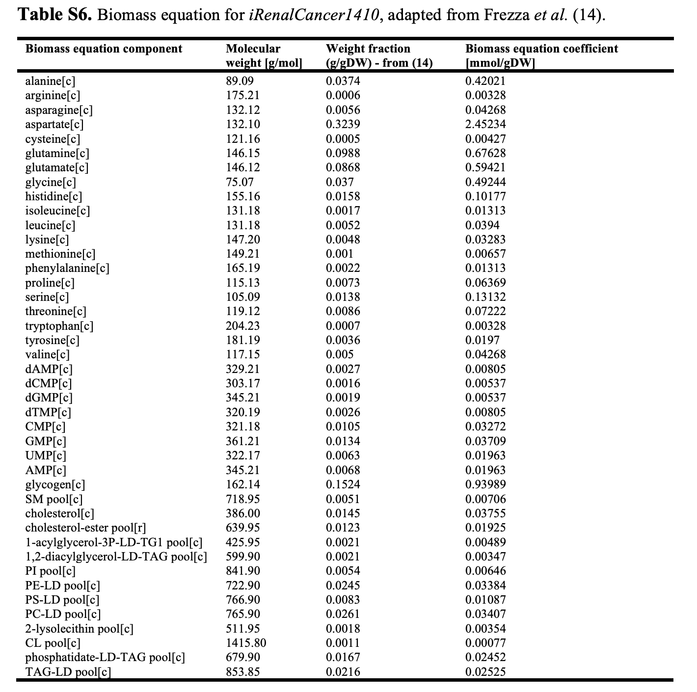

## Sample Simulations

### Cancer Biomass Simulations

Here, we use the metabolic models from the HMR INIT Cancer models which can be downloaded from **[here](http://www.metabolicatlas.org/downloads/initcan)**.

Download the models from the *"Chromosome 3p loss of heterozygosity is associated with a unique metabolic network in clear cell renal carcinoma"* reference paper (reference 3 models) by F. Gatto, I. Nookaew, and J. Nielsen.

There are 5 genome-scale metabolic models (GEMs) for cancer cells in the Human Metabolic
Atlas extracted from the above-mentioned paper.

These are:
1. iBreastCancer1771
2. iLiverCancer1715
3. iLungCancer1472
4. iRenalCancer1410
5. iUrothelialCancer1647

The above models are provided in SBML format. As all GEMs, these cancer GEMs are simulation-ready models.

To import these models, we use the RAVEN Toolbox method, *importModel* function.

The biomass equation is described as followed denoted as “CancerBiomass_OF” in the models and produces one unit of “cancer_biomass[s]”.



The above coefficients are derived assuming that metabolic fluxes are measured in terms of mmol
g<sub>DW</sub> <sup>-1</sup> h<sup>-1</sup>
.Units of cancer_biomass are secreted by the exchange rxn
“CancerBiomass_Ex”.

Make sure, when maximizing for biomass production, that both
reactions are correctly set in terms of bounds.


#### Sample Simulation with iRenalCancer1410

```
>> model = importModel('iRenalCancer1410.xml');
>> model=setParam(model,'eq',{'CancerBiomass_OF' 'CancerBiomass_Ex'},[1 1]);
>> model=setParam(model,'obj',{'CancerBiomass_OF'},1);
>> sol=solveLP(model);
>> sol

sol =

  struct with fields:

       x: [3914×1 double]
       f: -1
    stat: 1
     msg: 'Optimal solution found'
>> fprintf(['Yield of cancer_biomass[s] is ' num2str(sol.f*-1) ' units\n']);
Yield of cancer_biomass[s] is 1 units
>>
>> printFluxes(model,sol.x,true);
EXCHANGE FLUXES:
HMR_9031	(LDL remnant):	-1.2706e-05
HMR_9033	(NEFA blood pool in):	0.25092
HMR_9034	(glucose[x]):	5.3692
HMR_9035	(linoleate):	0.10549
HMR_9036	(linolenate):	0.019418
HMR_9038	(histidine):	0.10177
HMR_9039	(isoleucine[x]):	0.01313
HMR_9040	(leucine[x]):	0.0394
HMR_9041	(lysine[x]):	0.03283
HMR_9042	(methionine[x]):	0.00657
HMR_9043	(phenylalanine[x]):	0.01313
HMR_9044	(threonine[x]):	0.07222
HMR_9045	(tryptophan[x]):	0.00328
HMR_9046	(valine[x]):	0.04268
HMR_9048	(O2):	3.5706
HMR_9051	(LDL):	1.2706e-05
HMR_9058	(CO2):	-3.351
HMR_9062	(asparagine[x]):	0.04268
HMR_9063	(glutamine[x]):	0.67628
HMR_9064	(tyrosine[x]):	0.0197
HMR_9065	(cysteine):	0.00427
HMR_9066	(arginine[x]):	0.00328
HMR_9067	(glycine[x]):	0.49244
HMR_9068	(proline[x]):	3.3808
HMR_9069	(serine[x]):	0.17603
HMR_9073	(NH3):	0.23562
HMR_9078	(HCO3-):	-0.036998
HMR_9083	(choline[x]):	-0.04471
HMR_9086	(acetate):	-0.38534
HMR_9133	(pyruvate[x]):	-3.2213
HMR_9135	(L-lactate[x]):	-0.30142
HMR_9139	(fructose):	2.7532
HMR_9253	(adenine[x]):	0.01963
HMR_9259	(AKG[x]):	3.9113
HMR_9285	(cholesterol):	0.02891
HMR_9295	(cytidine[x]):	0.03272
HMR_9297	(deoxyadenosine[x]):	0.00805
HMR_9300	(deoxyguanosine):	0.00537
HMR_9353	(guanine):	0.03709
HMR_9361	(inositol):	0.00646
HMR_9411	(sphingosine-1-phosphate):	0.00706
HMR_9415	(succinate[x]):	-3.7034
HMR_9423	(thymidine[x]):	0.00805
HMR_9440	(UTP):	0.01963
HMR_9685	(D-glucitol[s]):	-5.3692
HMR_9690	(orotate[s]):	-0.093718
newExRxn_1	(2-phospho-D-glycerate[c]):	-0.36962
newExRxn_4	(3-phospho-D-glycerate[c]):	-3.6266
newExRxn_6	(trans-4-hydroxy-L-proline[c]):	-3.3171
newExRxn_9	(anthranilate[c]):	-0.42021
newExRxn_12	(phosphocholine[c]):	0.08938
newExRxn_14	(dCMP[c]):	0.00537
newExRxn_18	(fumarate[c]):	0.17715
newExRxn_22	(sn-glycerol-3-phosphate[c]):	0.14922
newExRxn_28	(4-hydroxy-2-quinolinecarboxylic acid[c]):	-2.8109
newExRxn_30	(kynurenine[c]):	3.2311
newExRxn_31	(malate[c]):	2.6614
newExRxn_32	(nicotinate ribonucleotide[c]):	-0.036998
newExRxn_33	(orotidine-5-phosphate[c]):	0.093718
newExRxn_34	(PEP[c]):	3.8923
newExRxn_35	(propanoate[s]):	-0.0033121
newExRxn_36	(quinolinate[c]):	0.036998
CancerBiomass_Ex	(CancerBiomass_ExchangeRxn):	1
```

Similar simulations can be done with the other cancer models also.

### Other RAVEN Toolbox Sample simulations

- Ran Sample simulations on Yeast Models with different objective functions and conditions around the samples from the tuutorials section of RAVEN Tooolbox, available **[here](https://github.com/SysBioChalmers/RAVEN/tree/master/tutorial)**.

References:
1. [Note on cancer genome-scale metabolic models](http://www.metabolicatlas.org/Note%20on%20cancer%20GEMs.pdf)
2. [Loss of heterozygosity is associated with a unique metabolic network in clear
cell renal carcinoma](https://www.pnas.org/content/early/2014/02/14/1319196111)
3. [Supplementary Info for Loss of heterozygosity is associated with a unique metabolic network in clear
cell renal carcinoma](https://www.pnas.org/content/pnas/suppl/2014/02/16/1319196111.DCSupplemental/sapp.pdf)
