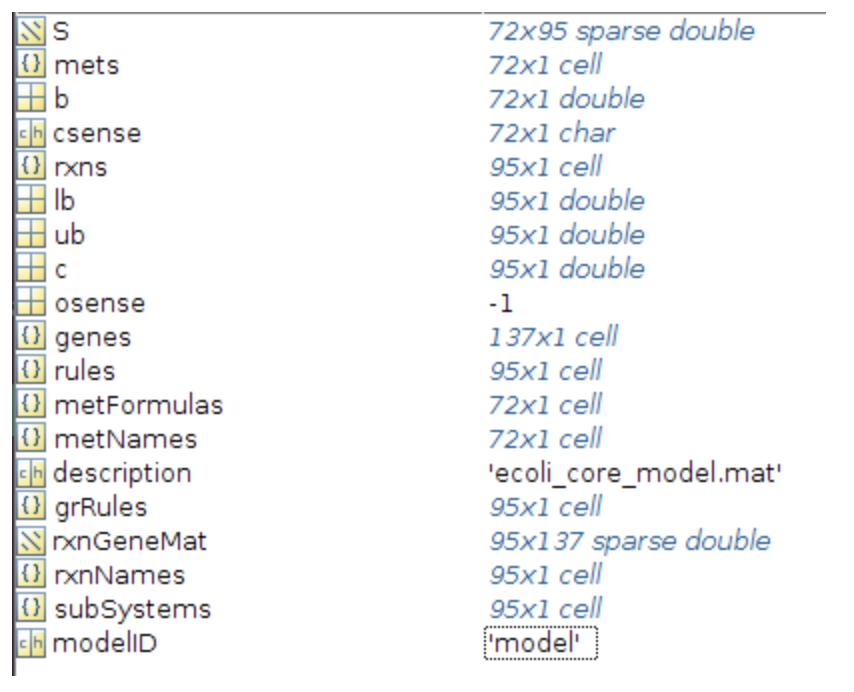
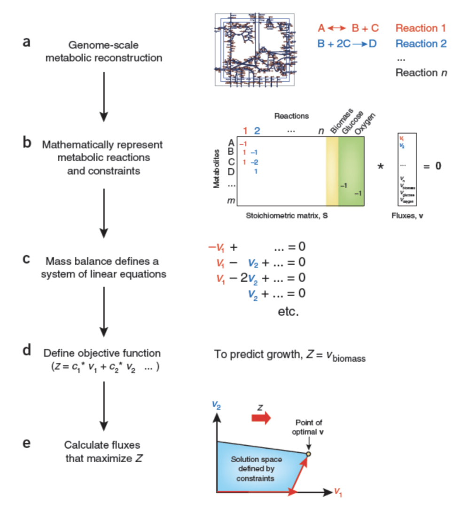

## Using the COBRA Toolbox

### Input and Output of Reconstructions and Models

The COBRA Toolbox supports the use of models in multiple formats, including:
- MAT-file format
- Systems Biology Markup Language (SBML) format
- SimPheny format
- Excel format

The most commonly used model format is a *MAT-file (.mat ) format* where by a simple MATLAB struct contains one or more of the fields defined [here](fields.md)

**To read a model into Cobra Toolbox:**

```
>>> initCobraToolbox();
>>> fileName = 'my_model.mat';
>>> model = readCbModel(fileName);
```

The **readCbModel** function has a second optional input that specifies the file type being loaded. In the above example the file type does not need to be specified since the input default is a 'Matlab' file type. To load file types other than a MAT-file, specificy the file type for input as: ‘SBML’, ‘SimPheny’, ‘SimPhenyPlus’, ‘SimPhenyText’, or 'Excel’.

Once the model is loaded it can be used directly with The COBRA Toolbox functions. On printing the loaded model contents, usually looks like below.



In general, the following fields should always be present:

- rxns, the identifiers of the reactions
- mets, the identifiers of the metabolites
- genes, the list of genes in your model (can be empty)
- rules, the Gene-protein-reaction rules in a computer readable format present in your model.
- S, the stoichiometric matrix
- lb, the lower bounds of the reactions
- ub, the upper bounds of the reactions
- osense, the objective sense (by convention, -1 indicates maximisation, 1 minimisation)
- b, Accumulation (positive) or depletion (negative) of the corresponding metabolites. 0 Indicates no concentration change.
- csense, indicator whether the b vector is a lower bound ('G'), upper bound ('L'), or hard constraint 'E' for the metabolite.

**To write a model from Cobra Toolbox:**

We use the **writeCbModel** function which has an optional input that specifies the file type in which the model should be written and saved. If the file type is not specified, the default file type to be saved is as a MAT-file. To use the function to write a file types other than a MAT-file, specificy the file type for input as: ‘text’,’xls’, or ‘sbml’.

*Sample Usage:*

```
writeCbModel(model, 'fileName','test_file.sbml','format','sbml')
```

### Flux Balance Analysis (FBA)

Through the use of genome-scale metabolic network reconstructions, Flux Balance Analysis (FBA) can be used to calculate the flow of metabolites through a metabolic network. This capability makes it possible to predict the growth rate of an organism and/or the rate of production of a given metabolite.

FBA has limitations! It does not use kinetic parameters, thus it cannot predict metabolite concentrations. It is also only capable of determining fluxes at steady state. Typically, FBA does not account for regulatory effects such as activation of enzymes by protein kinases or regulation of gene expression. Therefore, its predictions may not always be accurate.



Above is the flow chart for FBA Analysis.

Sample FBA Analysis:

```
initCobraToolbox
changeCobraSolver ('gurobi', 'all');
global CBTDIR

modelFileName = 'Recon2.0model.mat';

modelDirectory = getDistributedModelFolder(modelFileName); %Look up the folder for the distributed Models.

modelFileName= [modelDirectory filesep modelFileName]; % Get the full path. Necessary to be sure, that the right model is loaded

model = readCbModel(modelFileName);

modelaerobic = model;
printRxnFormula(model, 'DM_atp_c_');
modelaerobic = changeObjective (modelaerobic, 'DM_atp_c_');

modelaerobic = changeRxnBounds (modelaerobic, 'EX_glc(e)', -20, 'l');
modelaerobic = changeRxnBounds (modelaerobic, 'EX_o2(e)', -1000, 'l');

FBAaerobic = optimizeCbModel (modelaerobic, 'max')
```

When oxygen and all carbon sources (internal and external) are provided the flux through ATP demand reaction can reach its maximum rate of 1000 mol/min/gDW.

Refer: [Flux Balance Analysis Cobra](https://opencobra.github.io/cobratoolbox/stable/tutorials/tutorialFBA.html)


### Flux Variability analysis (FVA)

The flux distributions calculated by FBA are often not unique. In many cases, it is necessary for a biological system to achieve the same objective value by using alternate equivalent optimal pathways, creating phenotypically different alternate optimal solutions (silent phenotypes). For large models there can be a very large number of alternate equivalent optimal solutions.

Flux variability analysis (FVA) is a widely used computational tool for evaluating the minimum and maximum range of each reaction flux that can still satisfy the constraints using a double LP problem (i.e. a maximization and a subsequent minimization) for each reaction of interest.

Sample Run Example:

```
initCobraToolbox
changeCobraSolver ('gurobi', 'all');

global CBTDIR
modelFileName = 'Recon2.0model.mat';
modelDirectory = getDistributedModelFolder(modelFileName); %Look up the folder for the distributed Models.
modelFileName= [modelDirectory filesep modelFileName]; % Get the full path. Necessary to be sure, that the right model is loaded
model = readCbModel(modelFileName);

[selExc, selUpt] = findExcRxns(model);
uptakes = model.rxns(selUpt);
subuptakeModel = extractSubNetwork(model, uptakes);
hiCarbonRxns = findCarbonRxns(subuptakeModel,1);
modelalter = changeRxnBounds(model, hiCarbonRxns, 0, 'b');

energySources = {'EX_adp'; 'EX_amp(e)'; 'EX_atp(e)'; 'EX_co2(e)';...
'EX_coa(e)'; 'EX_fad(e)'; 'EX_fe2(e)'; 'EX_fe3(e)'; 'EX_gdp(e)';...
'EX_gmp(e)'; 'EX_gtp(e)'; 'EX_h(e)'; 'EX_h2o(e)'; 'EX_h2o2(e)';...
'EX_nad(e)'; 'EX_nadp(e)'; 'EX_no(e)'; 'EX_no2(e)'; 'EX_o2s(e)'};
modelalter = changeRxnBounds (modelalter, energySources, 0, 'l');

% modelfva1 represents aerobic condition
modelfva1 = modelalter;
modelfva1 = changeRxnBounds(modelfva1, 'EX_glc(e)', -20, 'l');
modelfva1 = changeRxnBounds(modelfva1, 'EX_o2(e)', -1000, 'l');

% modelfva2 represents anaerobic condition
modelfva2 = modelalter;
modelfva2 = changeRxnBounds(modelfva2, 'EX_glc(e)', -20, 'l');
modelfva2 = changeRxnBounds(modelfva2, 'EX_o2(e)', 0, 'l');


% Selecting several reactions of the model that we want to analyse with FVA
rxnsList = {'DM_atp_c_'; 'ACOAHi'; 'ALCD21_D'; 'LALDO'; 'ME2m';...
'AKGDm'; 'PGI'; 'PGM'; 'r0062'};

% Run FVA analysis for the model with the constraints that simulates aerobic conditions:
[minFlux1, maxFlux1, Vmin1, Vmax1] = fluxVariability(modelfva1, 100, 'max', rxnsList)

% Run FVA analysis for the model with the constraints that simulates anaerobic conditions:
[minFlux2, maxFlux2, Vmin2, Vmax2] = fluxVariability(modelfva2, [], [], rxnsList)
```

Refer: [Flux Variability analysis Cobra](https://opencobra.github.io/cobratoolbox/stable/tutorials/tutorialFVA.html)

### Extraction of Context-Specific Models

Genome-scale reconstruction of metabolism (GEM) can illuminate the molecular basis of cell phenotypes exhibited by an organism. Since some enzymes are only active in specific cell types or environmental conditions, several algorithms have been developed to extract context-specific models that capture the metabolism of individual tissues or cell types. Therefore, a context-specific model is a subset of the GEM, in which inactive reactions are removed.

Reaction removal is determined by the algorithm used, gene expression levels, presence of proteins or metabolites, experimental data availability, literature knowledge, and/or predefined metabolic functions of the cell type that need to be maintained in the extracted model. These decisions on methodology and data processing significantly influence the size, functionality and accuracy of constructed context-specific models.

While there is no strong evidence that one model extraction method (MEM) universally gives the most physiologically accurate models, each method has different underlying assumptions that affect the resulting model.

*Therefore, selection of the MEM and the associated parameters should be done while considering the goals of the study and the available data.*


Multiple algorithms have been suggested to automatically derive context specific networks from a generic reconstruction and a set of transcriptomic or proteomic data. The COBRA toolbox offers the following selection of extraction agorithms:

- FASTCORE  - Define one set of core reactions that is guaranteed to be active in the extracted model and find the minimum number of reactions possible to support the core;
- GIMME - Minimize usage of low-expression reactions while keeping the objective (e.g., biomass) above a certain value. Does not favor inclusion of reactions not related to the objective;
- iMAT - Find the optimal trade-off between including high-expression reactions and removing low-expression reactions;
- INIT - Find the optimal trade-off between including and removing reactions based on their given weights. If desired, accumulation of certain metabolites can be allowed or even forced;
- MBA - Define high-confidence reactions to ensure activity in the extracted model. Medium confidence reactions are only kept when a certain parsimony trade-off is met. In random order, prune other reactions and remove them if not required to support high- or medium- confidence reactions;
- mCADRE - Define a set of core reactions and prune all other reactions based on their expression, connectivity to core and confidence score. Remove reactions not necessary to support the core or defined functionalities. Core reactions are only removed if supported by a certain number of zero-expression reactions.


For convenience, there is a common interface to use these algorithms provided in the createTissueSpecificModel method. The method can be called as follow:

```
tissueModel = createTissueSpecificModel(model, options)
```

Example usage for iMAT:

```
modelFileName = 'ecoli_core_model.mat';
modelDirectory = getDistributedModelFolder(modelFileName); %Look up the folder for the distributed Models.
modelFileName= [modelDirectory filesep modelFileName]; % Get the full path. Necessary to be sure, that the right model is loaded

model = readCbModel(modelFileName);

load('dataEcoli');

options = 'options_iMAT';

load(['options_methods' filesep options]);

iMAT_model = createTissueSpecificModel(model, options);
```

For the iMAT method, the available parameter options are (with all options marked with * being optional):

- options.solver : 'iMAT'
- **options.expressionRxns :** gene expression data corresponding to model.rxns. Note : If no gene expression data are available for a reaction, set the value to -1 (Use mapExpressionToReactions function to get this from raw expresion data)
- **options.threshold_lb :** lower bound of gene expression threshold, reactions with expression below this value are "non-expressed"
- **options.threshold_ub :** upper bound of gene expression threshold, reactions with expression above this value are "expressed"
- options.tol* : minimum flux value for "expressed" reactions (default - 1e-8)
- options.core* : list of reaction names that are associated with a high confidence (default - no core reactions)
- options.logfile* : name of the file to save the MILP log (defaut - 'MILPlog')
options.runtime* : maximum solve time for the MILP (default - 7200s)


Refer: [Extraction of Context-Specific Models Cobra](https://opencobra.github.io/cobratoolbox/stable/tutorials/tutorialExtractionTranscriptomic.html)

[Back to Contents](../README.md)
